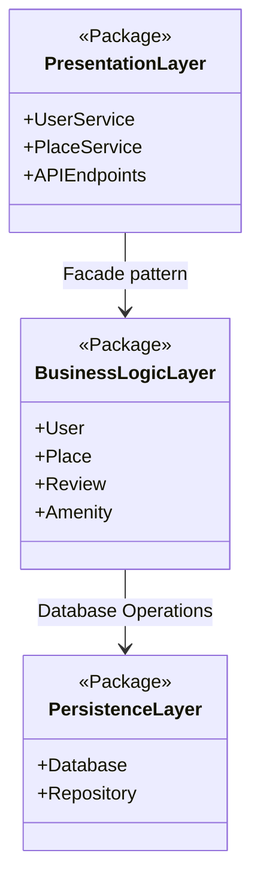
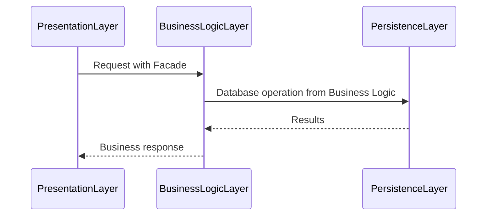

# Project Architecture - Technical Documentation

## :building_construction: Architecture Overview

Our application is based on **3-tier** architecture, which are 3 layers of each responsibilities.

## :bar_chart: Layers descriptions

### :dart: **PresentationLayer**
- **Responsability** : User interface
- **Components** :
  - `UserService` : Handling user operations
  - `PlaceService` : Handling place operations
  - `APIEndpoints` : Input/Output interface
### :gear: **BusinessLogicLayer**
- **Responsability** : Business rules and data processing
- **Components** :
  - `User` : User entity
  - `Place` : Place entity
  - `Review` : Review entity
  - `Amenity` : Place amenities entity
### :floppy_disk: **PersistenceLayer**
- **Responsability** : Data storage and retrieval
- **Components** :
  - `Database` : Database connection and management
  - `Repository` : Data access abstraction

## :link: Data Flow
### Interaction between layers:

## :circus_tent: Patterns and Couplings

### **Facade Pattern**

- **Coupling** : PresentationLayer → BusinessLogicLayer
- **Goal** : Streamline user interface and reduce complexity

### **Repository Pattern**

- **Coupling** : BusinessLogicLayer → PersistenceLayer
- **Goal** : Abstract data access and improve maintainability

## :bulb: Architecture Rationale

- **Separation of Concerns** : Each layer has a distinct responsibility
- **Maintainability** : Modular design for easier updates and debugging
- **Testability** : Independent layers facilitate unit testing
- **Scalability** : Scalable architecture to accommodate future growth
