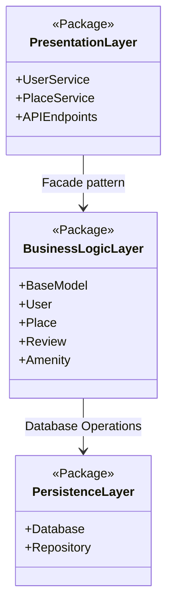

```mermaid
classDiagram
    class PresentationLayer {
        <<Package>>
        +UserService
        +PlaceService
        +APIEndpoints
    }
    class BusinessLogicLayer {
        <<Package>>
        +BaseModel
        +User
        +Place
        +Review
        +Amenity
    }
    class PersistenceLayer {
        <<Package>>
        +Database
        +Repository
    }
    PresentationLayer --> BusinessLogicLayer : Facade pattern
    BusinessLogicLayer --> PersistenceLayer : Database Operations
```
