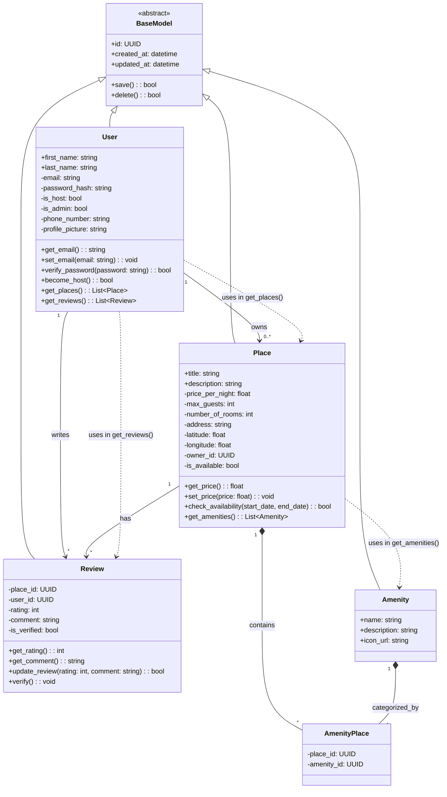

## Detailed Class Diagram

```mermaid
classDiagram
    class BaseModel {
        <<abstract>>
        +id: UUID
        +created_at: datetime
        +updated_at: datetime
        +save(): bool
        +delete(): bool
    }
    class User {
        +first_name: string
        +last_name: string
        -email: string
        -password_hash: string
        -is_host: bool
        -is_admin: bool
        -phone_number: string
        -profile_picture: string
        +get_email(): string
        +set_email(email: string): void
        +verify_password(password: string): bool
        +become_host(): bool
        +get_places(): List~Place~
        +get_reviews(): List~Review~
    }
    class Place {
        +title: string
        +description: string
        -price_per_night: float
        -max_guests: int
        -number_of_rooms: int
        -address: string
        -latitude: float
        -longitude: float
        -owner_id: UUID
        -is_available: bool
        +get_price(): float
        +set_price(price: float): void
        +check_availability(start_date, end_date): bool
        +get_amenities(): List~Amenity~
    }
    class Review {
        -place_id: UUID
        -user_id: UUID
        -rating: int
        -comment: string
        -is_verified: bool
        +get_rating(): int
        +get_comment(): string
        +update_review(rating: int, comment: string): bool
        +verify(): void
    }
    class Amenity {
        +name: string
        +description: string
        +icon_url: string
    }
    class AmenityPlace {
        -place_id: UUID
        -amenity_id: UUID
    }
    %% Inheritance Relationships
    BaseModel <|-- User
    BaseModel <|-- Place
    BaseModel <|-- Amenity
    BaseModel <|-- Review
    %% Association Relationships
    User "1" --> "0..*" Place : owns
    User "1" --> "*" Review : writes
    Place "1" --> "*" Review : has
    %% Composition Relationships
    Place "1" *-- "*" AmenityPlace : contains
    Amenity "1" *-- "*" AmenityPlace : categorized_by
    %% Dependency Relationships
    User ..> Place : uses in get_places()
    User ..> Review : uses in get_reviews()
    Place ..> Amenity : uses in get_amenities()
```