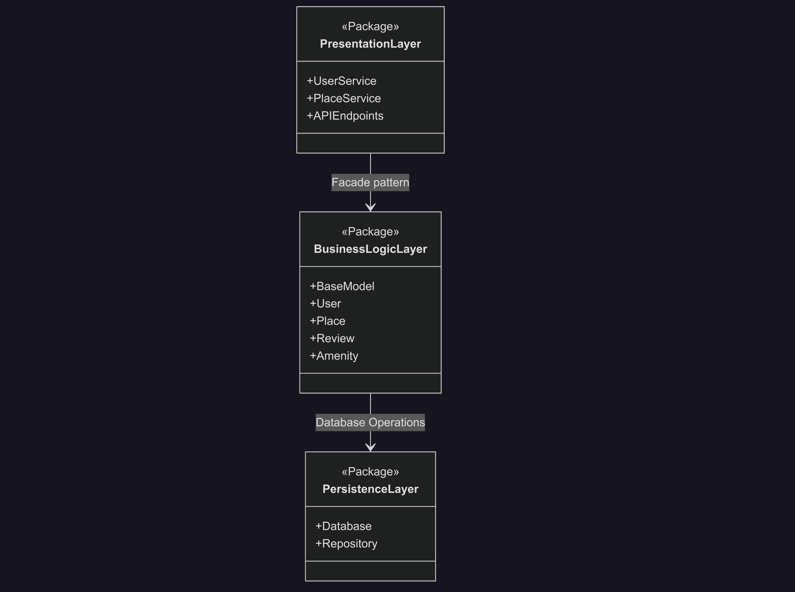
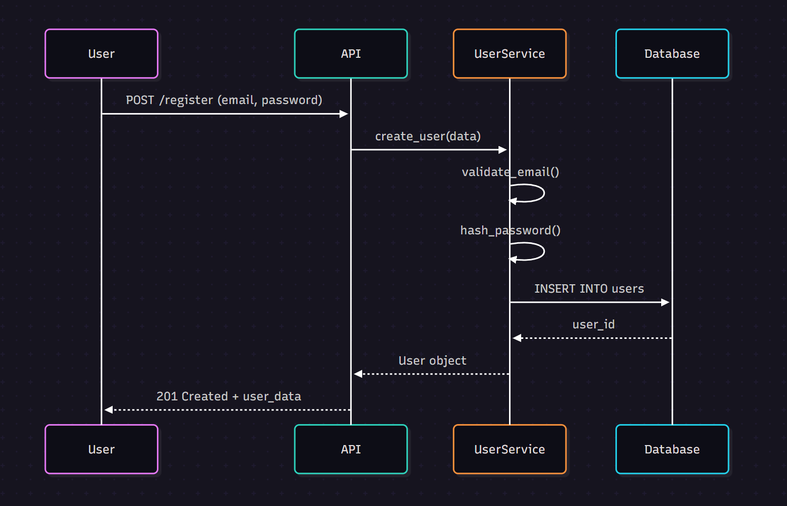
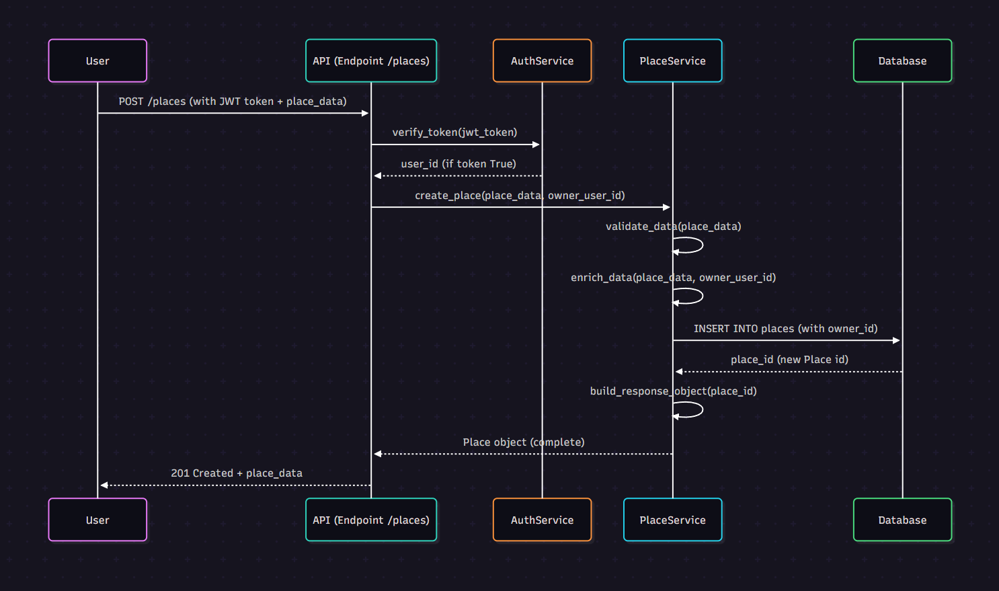
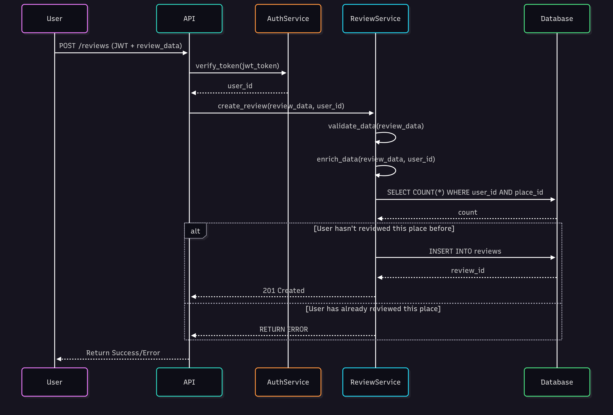
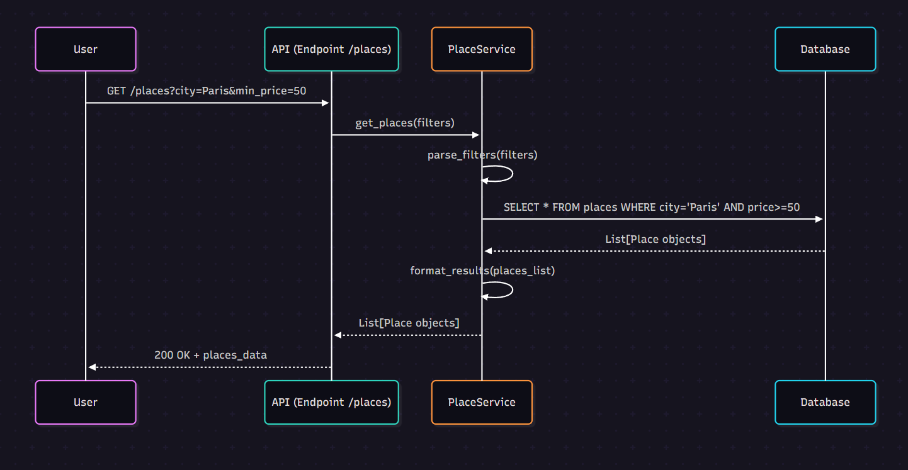

# 📋 Technical Documentation - HBnB Project
---

## 1. Introduction

### 1.1 Project Overview

HBnB is a rental platform connecting hosts and guests for short-term property rentals. The system is designed with a 3-tier architecture, separating __Presentation, Business logic, and Persistence layers__ to ensure scalability, maintainability, and security.

### 1.2 Document Purpose
This document provides a comprehensive overview of the HBnB system architecture, focusing on the __Business logic layer, Entity relationships, and API interaction flows__. It serves as a blueprint for developers and stakeholders to understand the design decisions and implementation strategies.

### 1.3 Scope
__This documentation covers :__

	High-level system architecture

	Business logic layer design

	API interaction flows

	Database relationships

	Security and validation patterns

## 2. High-Level Architecture

### 2.1 Architectural Pattern

The application follows a 3-tier architecture with clear separation of concerns between Presentation, Business logic, and Persistence layers.

### 2.2 Package Diagram

<div align="center">
	
</div>

### 2.3 Layer Descriptions

🎯 __Presentation Layer
Responsibility :__ User interface and API endpoints

	Key Components :

	UserService : Handles user operations and authentication

	PlaceService : Manages property-related operations

	APIEndpoints : RESTful interface for client interactions

⚙️ __Business Logic Layer
Responsibility :__ Business rules, data processing, and validation

	Key Components :

	BaseModel : Abstract base class for all entities

	Core entities: User, Place, Review, Amenity

💾 __Persistence Layer
Responsibility :__ Data storage, retrieval, and database management

	Key Components :

	Database : Connection management and query execution

	Repository : Data access abstraction layer

### 2.4 Data Flow
```
sequenceDiagram
	participant P as PresentationLayer
	participant B as BusinessLogicLayer
	participant D as PersistenceLayer
	P->>B: Request with Facade
	B->>D: Database operation from Business Logic
	D-->>B: Results
	B-->>P: Business response
```
### 2.5 Design Patterns

__Facade Pattern__

Implementation: PresentationLayer → BusinessLogicLayer

Purpose: Simplifies client interactions and reduces complexity

Benefit: Provides a unified interface to complex subsystems

Repository Pattern
Implementation: BusinessLogicLayer → PersistenceLayer

Purpose: Abstracts data access logic

Benefit: Improves maintainability and testability

### 2.6 Architecture Rationale

Separation of Concerns: Each layer has distinct responsibilities

Maintainability: Modular design facilitates updates and debugging

Testability: Independent layers enable comprehensive unit testing

Scalability: Architecture supports horizontal scaling

Security: Layered validation and authentication

## 3. Business Logic Layer

### 3.1 Class Diagram Overview

The business logic layer implements the core domain model with entities representing users, properties, reviews, and amenities.

### 3.2 Entity Specifications
🔹 __BaseModel (Abstract Class)__

	Purpose: Foundation for all business entities providing common functionality

	Attributes:

		id (UUID): Universal unique identifier (UUID4 standard)

		created_at (datetime): Automatic creation timestamp

		updated_at (datetime): Automatic modification timestamp

	Methods:

		save(): Handles persistence with automatic timestamp updates

		delete(): Manages entity removal with proper cleanup

👤 __User Entity__

	Purpose: Represents system users with role-based capabilities

	Attributes:

		first_name, last_name (string): Personal identification

		email (private): Primary contact and authentication

		phone_number (private): Optional contact information

		profile_picture (string): User avatar URL

		is_host (bool): Host capability flag

		is_admin (bool): Administrative privileges

		password_hash (private): Secure authentication storage

	Methods:

		get_email(): Controlled email access

		set_email(): Validated email updates

		become_host(): Role transition to host

		verify_password(): Authentication validation

		get_places(): Retrieves owned properties

		get_reviews(): Fetches user's reviews

🏠 __Place Entity__

	Purpose: Manages rental property information and availability

	Attributes:

		title (string): Property listing headline

		description (string): Detailed property information

		price_per_night (private): Dynamic pricing

		max_guests (private): Capacity constraints

		number_of_rooms (private): Room count for filtering

		address (private): Physical location

		latitude, longitude (private): Geographic coordinates

		owner_id (UUID): Property owner reference

		is_available (private): Booking availability status

	Methods:

		get_price(): Controlled price access

		set_price(): Validated price updates

		check_availability(): Reservation conflict validation

		get_amenities(): Associated features retrieval

⭐ __Review Entity__

	Purpose: Handles user feedback with verification capabilities

	Attributes:

		place_id (UUID): Reviewed property reference

		user_id (UUID): Review author reference

		rating (private): Quality assessment (1-5 scale)

		comment (private): Detailed feedback

		is_verified (private): Authenticity verification status

	Methods:

		get_rating(): Controlled rating access

		get_comment(): Controlled comment access

		update_review(): Limited-time modifications

		verify(): Review validation process

🛋️ __Amenity Entity__

	Purpose: Manages property features for search and filtering

	Attributes:

		name (string): Feature identification

		description (string): Detailed explanation

		icon_url (string): Visual representation

🔗 __AmenityPlace (Association Class)__

	Purpose: Manages many-to-many relationships between properties and amenities

	Attributes:

		place_id (UUID): Place foreign key

		amenity_id (UUID): Amenity foreign key

### 3.3 Relationship Architecture

Inheritance Relationships
Pattern: BaseModel <|-- [Entity]

Benefit: Code reuse and consistent behavior across entities

Principle: Open/Closed principle compliance

Association Relationships
User -- Place (ownership): Bidirectional association supporting host functionality

User -- Review (authorship): Ensures review traceability and accountability

Place -- Review (feedback): Enables rating calculations and reputation management

Composition Relationships
Place -- AmenityPlace & Amenity -- AmenityPlace: Strong compositions ensuring referential integrity

Dependency Relationships
Temporary usage relationships for method collaborations

Maintains loose coupling while enabling necessary interactions

### 3.4 Business Logic Implementation

User Role Management: Host/guest duality with role-based access control

Privacy and Security: Private attributes with controlled access methods

Review Integrity: Authentic, traceable feedback with verification

Property Management: Data consistency for features and search capabilities

Geospatial Services: Location-based functionality through coordinates

Dynamic Pricing: Flexible pricing models with validation

Capacity Planning: Intelligent booking validation through guest limits

## 4. API Interaction Flow

### 4.1 User Registration

Endpoint: POST /register

Sequence:

<div align="center">
	
</div>

	Security Considerations:

	Password hashing before storage

	Email format validation

	No authentication required for this endpoint

### 4.2 Place Creation
Endpoint: POST /places

Sequence:

<div align="center">
	
</div>

	Authentication & Authorization:

	JWT token verification required

	Automatic owner_id assignment from token

	Host role validation (is_host=true)

### 4.3 Review Submission
Endpoint: POST /reviews

Sequence:

<div align="center">
	
</div>

	Business Rules:

	One-review-per-user constraint

	Rating validation (1-5 scale)

	Comment moderation capabilities

	Review verification system

### 4.4 Fetching Places List
Endpoint: GET /places

Sequence:

<div align="center">
	
</div>

	Supported Filters:

	City/location-based filtering

	Price range (min_price, max_price)

	Guest capacity (max_guests)

	Room count (number_of_rooms)

	Geographic proximity (coordinates)

	Performance Optimizations:

	Database indexing on filter columns

	Pagination for large result sets

	Efficient query optimization

### 4.5 Layer Interaction Patterns
Presentation Layer (API)
Request routing and endpoint management

Initial authentication checks

Input validation and sanitization

Response formatting and HTTP status management

Business Logic Layer (Services)
Core business rules enforcement

Data validation and enrichment

Relationship management

Security and access control logic

Persistence Layer (Database)
Data storage and retrieval

Query optimization and execution

Transaction management

Data integrity enforcement

### 4.6 Security & Validation Patterns

Authentication Flow
text
Client → [JWT Token] → API → AuthService → [user_id] → Business Logic
Validation Hierarchy
Input Validation (API Layer) - Syntax checking

Business Validation (Service Layer) - Rule enforcement

Data Validation (Database Layer) - Integrity constraints

HTTP Status Code Usage
200 OK - Successful retrieval operations

201 Created - Successful resource creation

400 Bad Request - Client-side validation errors

401 Unauthorized - Authentication failures

404 Not Found - Resource not found

500 Internal Server Error - Server-side issues

## 5. Design Principles & Best Practices
### 5.1 Applied Principles

Separation of Concerns: Distinct layer responsibilities

Single Responsibility: Each class has one reason to change

Open/Closed: Entities open for extension, closed for modification

Loose Coupling: Minimal dependencies between components

### 5.2 Security Considerations
Layered authentication and authorization

Private attributes with controlled access

Input validation at multiple levels

Secure password handling

### 5.3 Performance Optimizations
Efficient database query patterns

Minimal data transfer between layers

Appropriate caching strategies

Horizontal scaling capabilities

### 5.4 Maintainability Features
Modular architecture

Consistent naming conventions

Comprehensive documentation

Test-friendly design

## 6. Conclusion
This technical documentation provides a comprehensive blueprint for the HBnB project implementation. The 3-tier architecture with clear separation of concerns, well-defined business entities, and structured API interactions forms a solid foundation for building a scalable and maintainable rental platform.

The design decisions outlined in this document balance performance, security, and flexibility while maintaining code quality and developer productivity throughout the implementation lifecycle.

Document Version: 1.0
Last Updated: [03/10/2024]
Authors: [Schps & Rpok for Holberton School]