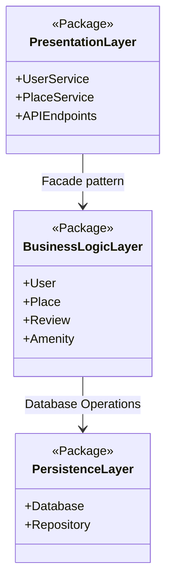
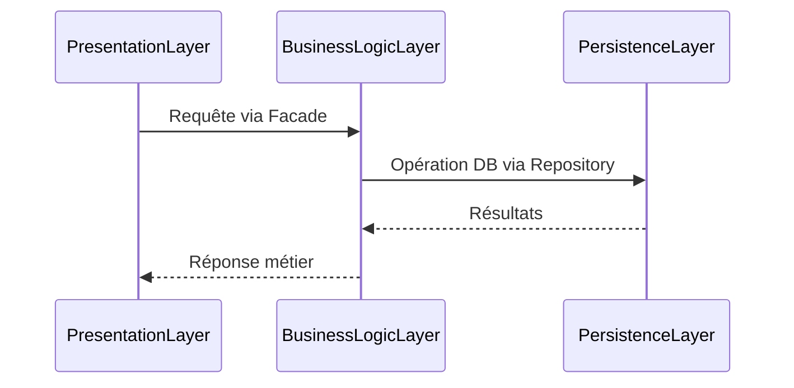

# Architecture du Projet - Documentation Technique

## :building_construction: Overview de l'Architecture

Notre application suit une architecture **3-tier** (3 couches) avec séparation claire des responsabilités.

## :bar_chart: Description des Couches

### :dart: **PresentationLayer** (Couche Présentation)
- **Responsabilité** : Interface avec l'utilisateur/API clients
- **Composants** :
  - `UserService` : Gestion des utilisateurs
  - `PlaceService` : Gestion des lieux
  - `APIEndpoints` : Points d'entrée REST/GraphQL
### :gear: **BusinessLogicLayer** (Couche Métier)
- **Responsabilité** : Logique métier et règles de gestion
- **Entités Métier** :
  - `User` : Entité utilisateur
  - `Place` : Entité lieu
  - `Review` : Entité avis
  - `Amenity` : Entité commodité
### :floppy_disk: **PersistenceLayer** (Couche Persistance)
- **Responsabilité** : Stockage et récupération des données
- **Composants** :
  - `Database` : Base de données
  - `Repository` : Pattern d'accès aux données

## :link: Flux des Données
### Schéma d'Interaction :

## :circus_tent: Patterns Utilisés

### **Facade Pattern**

- **Couplage** : PresentationLayer → BusinessLogicLayer
- **But** : Simplifier l'interface pour la couche présentation

### **Repository Pattern**

- **Couplage** : BusinessLogicLayer → PersistenceLayer
- **But** : Abstraction de l'accès aux données

## :bulb: Justifications Architecturales

- **Séparation des concerns** : Chaque couche a une responsabilité unique
- **Maintenabilité** : Modifications isolées par couche
- **Testabilité** : Couches indépendantes testables séparément
- **Évolutivité** : Possibilité de changer une couche sans affecter les autres